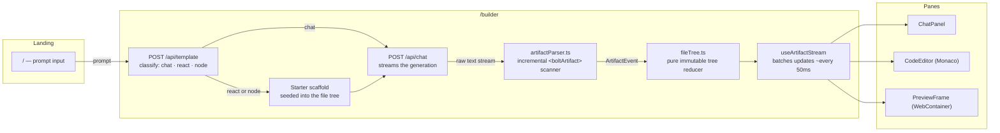

# CraftAI

Turn your ideas into websites. CraftAI is an AI-powered website builder that generates fully functional websites from a simple text prompt — no coding required.


## Architecture

CraftAI goes from prompt to live preview in three stages: classify, generate, render.



Both API routes are stateless — the client (`src/app/builder/page.tsx`) owns all
conversation history and resends it each turn, trimmed to fit the model's
per-minute token budget (`src/lib/chatStream.ts`). There is no database: the
project, chat history and file tree live in React state, snapshotted to
`localStorage` (`src/lib/builderPersistence.ts`) so a refresh of `/builder`
resumes the same project instead of losing it — one project at a time, scoped
to a single browser tab, not a substitute for real server-side persistence.


## Setup

### 1. Install dependencies

```bash
pnpm install
```

### 2. Add your Groq API key

CraftAI runs entirely on [Groq](https://console.groq.com). There is one required
environment variable.

1. Go to [console.groq.com](https://console.groq.com) and sign up or log in.
2. Open the **API Keys** section and create a new key.
3. Copy `.env.example` to `.env.local` and paste the key in:

```bash
cp .env.example .env.local
```

```bash
# .env.local
GROQ_API_KEY=your_groq_api_key_here
```

`.env.local` is gitignored — never commit it. Restart the dev server after
changing it; Next.js only reads env files at startup.

### 3. Run the dev server

```bash
pnpm dev
```

Open [http://localhost:3000](http://localhost:3000) to see the landing page. Type a prompt, hit send, and the builder will generate your site.


## Models

Both models are served by Groq and are chosen per task:

| Task | Model |
| --- | --- |
| Site/artifact generation | `openai/gpt-oss-120b` |
| Project classification (react vs. node) | `qwen/qwen3.8-27b` |

The model ids live in `src/lib/ai/groq.ts`. They were verified against the Groq
models endpoint for this account — the full public Groq catalogue is not
necessarily available to every key, so check before swapping one out.


## API

Both routes are `POST`-only and are called by the builder UI.

### `POST /api/chat`

Streams the generated project back as plain text.

**Request**

```json
{
  "messages": [
    { "role": "user", "content": "Build me a landing page for a coffee shop" }
  ]
}
```

`messages` must be an array — a single `message` string is not accepted. Each
entry needs a string `content` and a `role` of `user` or `assistant`. The server
owns the system prompt: client-supplied `system` turns are stripped, not
rejected. The whole conversation is capped at 200,000 characters.

**Response**

A streaming `text/plain` body (`Cache-Control: no-store`). Read it incrementally
rather than waiting for the whole response:

```javascript
const res = await fetch("/api/chat", {
  method: "POST",
  headers: { "Content-Type": "application/json" },
  body: JSON.stringify({
    messages: [{ role: "user", content: "Your prompt" }],
  }),
});

const reader = res.body.getReader();
const decoder = new TextDecoder();
while (true) {
  const { done, value } = await reader.read();
  if (done) break;
  process.stdout.write(decoder.decode(value, { stream: true }));
}
```

**cURL**

```bash
curl -N -X POST http://localhost:3000/api/chat \
  -H "Content-Type: application/json" \
  -d '{"messages":[{"role":"user","content":"What is Next.js?"}]}'
```

**In-band stream signals**

Once the stream has started the HTTP status is already committed to `200`, so
anything that goes wrong afterwards is appended to the body as a sentinel. A
client that parses the artifact text must handle both:

| Sentinel | Meaning |
| --- | --- |
| `<craftaiTruncated/>` | The model hit the output-token ceiling mid-artifact. The file tree is incomplete; request a continuation rather than rendering it as finished. |
| `<craftaiError>{"code":"...","message":"..."}</craftaiError>` | The generation failed partway. `code` is one of the error codes below. |

### `POST /api/template`

Classifies a prompt as a React or Node project and returns the matching starter
scaffold and system prompts.

**Request**

```json
{ "prompt": "Build me a landing page for a coffee shop" }
```

`prompt` must be a non-empty string.

**Response**

```json
{
  "classification": "react",
  "prompts": ["<system prompt>", "<project context prompt>"],
  "uiPrompts": ["<base scaffold artifact>"]
}
```

`classification` is constrained to exactly `"react"` or `"node"` — the classifier
uses enum-constrained output, so there is no third case to handle. `prompts` is
`[systemPrompt, contextPrompt]` and `uiPrompts` is `[baseScaffold]`; the builder
client depends on that shape.

**cURL**

```bash
curl -X POST http://localhost:3000/api/template \
  -H "Content-Type: application/json" \
  -d '{"prompt":"a REST API for a todo list"}'
```

### Rate limits

Both routes check a local, in-process limiter (`src/lib/rateLimit.ts`) before
touching Groq at all, so a refusal here costs nothing upstream:

| Route | Limit |
| --- | --- |
| `POST /api/chat` | 6 requests/minute, 40/hour |
| `POST /api/template` | 20 requests/minute |

A refusal is `429 too_many_requests` with a `Retry-After` header. This is a
per-process counter keyed on `X-Forwarded-For`/`X-Real-IP` — a speed bump
against casual abuse behind a trusted proxy, not real access control (either
header is client-supplied and trivially spoofed without one). See the file's
own comments for the honest limits of that.

### Errors

Errors are JSON with a stable machine-readable `error` code. The shared codes and
their statuses live in `src/lib/ai/groq.ts`:

| Status | Body | Meaning |
| --- | --- | --- |
| 400 | `{ "error": "invalid_body", "message": "..." }` | The request body was not valid JSON, or failed validation. |
| 413 | `{ "error": "payload_too_large", "message": "..." }` | The request itself exceeded the route's own character cap (200,000 for `/api/chat`, 8,000 for `/api/template`) — rejected before Groq is ever called. |
| 413 | `{ "error": "request_too_large", "message": "..." }` | `/api/chat` only. The request passed our cap but Groq rejected it anyway: prompt + completion exceeds the account's tokens-per-minute allowance. |
| 429 | `{ "error": "too_many_requests", "message": "..." }` | The local rate limiter above refused the request. Has a `Retry-After` header. |
| 429 | `{ "error": "quota_exceeded", "message": "..." }` | Groq's own rate limit or credits are exhausted. The builder surfaces this as a modal. |
| 502 | `{ "error": "upstream_rejected", "message": "..." }` | The server sent Groq a malformed request — a server-side bug, not something retrying fixes. |
| 500 | `{ "error": "internal_error" }` | Unexpected failure. Upstream detail is logged server-side only, never returned. |
| 503 | `{ "error": "missing_api_key", "message": "..." }` | `GROQ_API_KEY` is unset or empty. |

Errors raised after a stream has started are delivered as the
`<craftaiError>` sentinel described above rather than as a status code — by
then the HTTP status is already committed to `200`.


## Scripts

```bash
pnpm dev        # start the dev server
pnpm build      # production build
pnpm start      # serve the production build
pnpm lint       # eslint
pnpm typecheck  # tsc --noEmit
```


## Troubleshooting

**`GROQ_API_KEY is not set` / 503 `missing_api_key`**
`.env.local` is missing, or holds a placeholder instead of a real key. Add the
key and restart the dev server — env files are read only at startup.

**429 `too_many_requests`**
You've hit CraftAI's own local rate limit, not Groq's. Wait for the window in
the `Retry-After` header (or see the table above) and retry.

**429 `quota_exceeded`**
You have hit Groq's rate limit or exhausted your credits. Wait and retry, or
check your usage in the Groq console.

**400 from `/api/chat`**
The body must be `{ "messages": [...] }` with an array of chat messages. A bare
`{ "message": "..." }` string is rejected.

**The model id is rejected**
Model access varies by account. Check which ids your key can actually reach
before editing `src/lib/ai/groq.ts`.

**The preview does not load**
The in-browser preview runs on WebContainers, which need a modern
Chromium-based or Firefox browser and cross-origin isolation headers. Use
`pnpm dev` rather than opening the built files directly.


## Resources

- [Groq documentation](https://console.groq.com/docs)
- [Vercel AI SDK](https://sdk.vercel.ai)
- [Next.js route handlers](https://nextjs.org/docs/app/building-your-application/routing/route-handlers)
